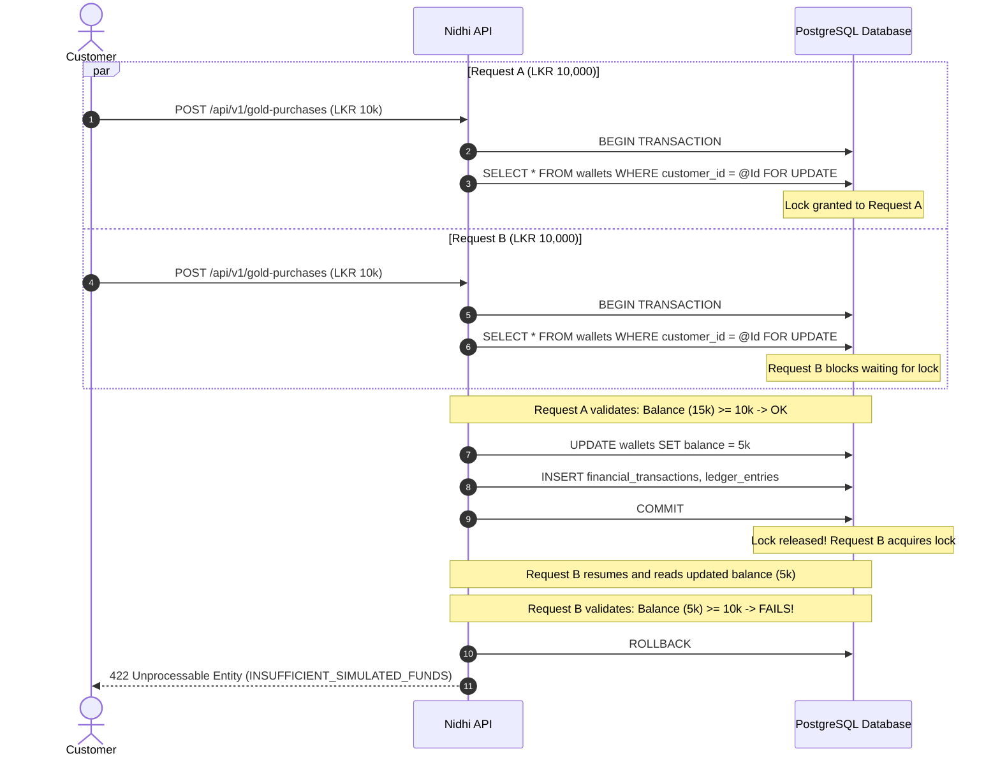
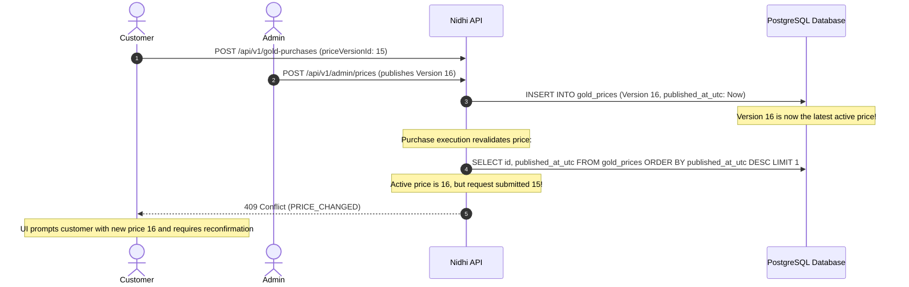
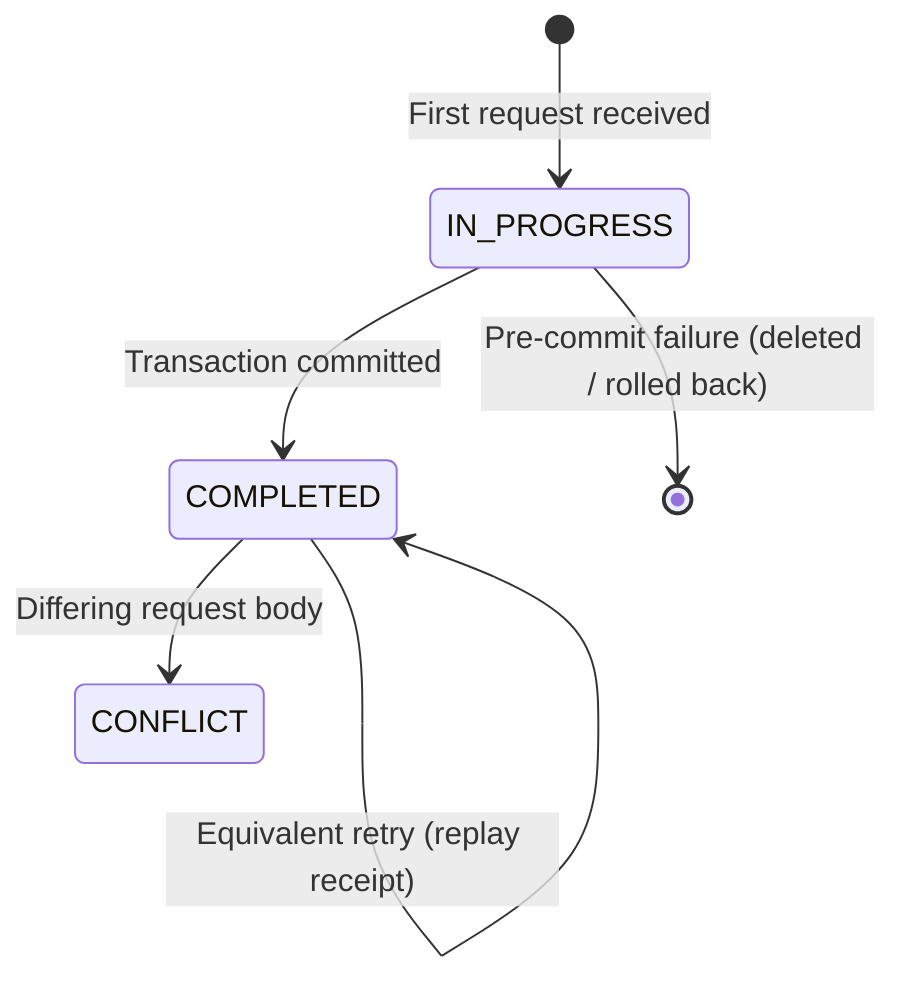

# Nidhi v1 Concurrency & Idempotency Design

This document details the concurrency control, locking mechanisms, race-condition mitigation, and idempotency guarantees for Nidhi v1. It implements the requirements in [OPEN_DECISIONS.md](../requirements/OPEN_DECISIONS.md) (OD-003, OD-006, OD-012), [NON_FUNCTIONAL_REQUIREMENTS.md](../requirements/NON_FUNCTIONAL_REQUIREMENTS.md) (NFR-DATA-002, NFR-DATA-003), and [USER_STORIES.md](../requirements/USER_STORIES.md).

---

## 1. Concurrency Control Strategy

Nidhi is a financial simulation with strict conservation laws: balances must never drop below zero, wallet caps must not be breached, and duplicate commands must never result in duplicate financial credits.

We evaluate two concurrency strategies for financial mutation operations:

| Strategy | Mechanism | Pros | Cons | Recommendation |
|---|---|---|---|---|
| **Optimistic Concurrency Control (OCC)** | PostgreSQL `xmin` system column mapped via Npgsql/EF Core `IsRowVersion()` (ODQ-002). | Zero application overhead; native PostgreSQL tracking. | Optimistic retries are unsuitable for high-contention multi-entity financial operations. | Used for non-financial mutable entities and defense-in-depth on `wallets` and `gold_holdings`. |
| **Pessimistic Row Locking (`SELECT ... FOR UPDATE`)** | Acquire an exclusive row lock on the customer's `wallets` row at transaction start. | Guarantees deterministic serialization of all financial actions per customer; zero retry loops needed; prevents race conditions on balance caps and daily limits. | Slightly longer lock duration during transaction processing. Because locks are strictly scoped to a single customer, there is **zero cross-customer contention**. | **SELECTED for Financial Operations** |

### Decision: Pessimistic Row Locking for Financial Mutations (ODQ-002)
Critical financial operations (`WALLET_FUNDING` and `GOLD_PURCHASE`) begin by locking the customer's `wallets` record using PostgreSQL row-level locking (`SELECT ... FOR UPDATE` via EF Core or raw SQL). Because each customer only locks their own wallet, throughput scales linearly with the number of customers without global database bottlenecks.

Under ODQ-002, PostgreSQL's `xmin` system column is mapped as an optimistic concurrency token on mutable entities, but `xmin` does **not** replace financial transaction concurrency controls: critical mutations strictly rely on PostgreSQL database transactions, wallet row locking (`FOR UPDATE`), database check constraints, and scoped idempotency records.

---

## 2. Race Condition Analysis & Solutions

### 2.1. Scenario 1: Concurrent Gold Purchases (Wallet Overspending)

**The Problem**:
A customer with LKR 15,000.00 in their wallet simultaneously submits two gold purchase requests for LKR 10,000.00 each (Request A and Request B). If both requests read the balance concurrently, both see LKR 15,000.00, approve the purchase, and leave the wallet at -LKR 5,000.00.

**The Solution**:


**Database Invariant Protection**:
In addition to application row locking, the PostgreSQL table `wallets` includes a database check constraint:
```sql
ALTER TABLE wallets ADD CONSTRAINT chk_wallets_balance_non_negative CHECK (balance_lkr >= 0.00);
```
Even if an application-level bug bypassed row locking, PostgreSQL would abort any transaction attempting to make a wallet balance negative.

---

### 2.2. Scenario 2: Concurrent Wallet Funding (Wallet Cap & Daily Count Violations)

**The Problem**:
A customer with LKR 4,900,000.00 sends two concurrent funding requests for LKR 200,000.00 each. The wallet cap is LKR 5,000,000.00. Similarly, a customer who has completed 19 funding operations today sends two concurrent funding requests; at most one should succeed to respect the 20 operations/day limit (OD-003).

**The Solution**:
1. Acquire exclusive lock on the customer's `wallets` row (`FOR UPDATE`).
2. Verify: `CurrentBalance + RequestAmount <= 5,000,000.00`.
3. Count successful funding operations within the current **UTC calendar day**:
   ```sql
   SELECT COUNT(*)
   FROM financial_transactions
   WHERE customer_id = @CustomerId
     AND type = 'WALLET_FUNDING'
     AND status = 'COMPLETED'
     AND created_at_utc >= @StartOfUtcDay;
   ```
4. If `Count >= 20`, reject with `422 Unprocessable Entity` (`DAILY_FUNDING_LIMIT_EXCEEDED`).
5. Otherwise, credit wallet, record transaction and ledger entries, and commit.
6. Database check constraint:
   ```sql
   ALTER TABLE wallets ADD CONSTRAINT chk_wallets_max_balance CHECK (balance_lkr <= 5000000.00);
   ```

---

### 2.3. Scenario 3: Price Publication During Purchase Execution (OD-006)

**The Problem**:
A customer reviews an active price (Version 15, LKR 30,000.00/g) and clicks "Save Gold". Exactly as the request reaches the server, an Administrator publishes Version 16 (LKR 31,000.00/g). Silently substituting Version 16 violates OD-006 and changes the customer's financial outcome without consent.

**The Solution**:


**Execution Rules**:
- Client requests **must** submit `priceVersionId`.
- At execution, the server queries the currently active price version (latest `published_at_utc`).
- If `submittedPriceVersionId != activePriceVersionId`, immediately reject with HTTP `409 Conflict` and error code `PRICE_CHANGED`.
- If `(NowUtc - activePrice.PublishedAtUtc) > 24 hours`, immediately reject with HTTP `503 Service Unavailable` and error code `PRICE_STALE`.
- **No silent substitution**: A newer price is never applied automatically without explicit customer submission.

---

### 2.4. Scenario 4: Concurrent Administrative Price Publication

**The Problem**:
Two administrators publish new prices at the exact same millisecond.

**The Solution**:
- Price publishing transactions acquire a table-level advisory lock or perform an atomic insert:
  ```sql
  INSERT INTO gold_prices (id, price_per_gram_lkr, published_at_utc, published_by_admin_id, reason)
  VALUES (gen_random_uuid(), @Price, NOW(), @AdminId, @Reason);
  ```
- Because timestamps use PostgreSQL microsecond precision (`timestamptz`), ordering by `published_at_utc DESC, id DESC` is completely deterministic.
- Each publication creates a unique, immutable version.

---

## 3. Idempotency Architecture (OD-012)

Financial commands (`POST /api/v1/wallet/fundings` and `POST /api/v1/gold-purchases`) require an `Idempotency-Key` HTTP header.

### 3.1. Idempotency Key Scope & Representation

- **Scope**: Scoped uniquely by `(CustomerId, Operation, IdempotencyKey)`.
- **Request Content Binding**: The server computes a SHA-256 hash of the canonicalized request body (e.g., amount, priceVersionId).
- **State Machine**:



### 3.2. Idempotency Workflow Implementation

```text
1. Client sends request with header: `Idempotency-Key: {uuid}`
2. Compute requestHash = SHA256(canonicalJson(requestBody))
3. BEGIN TRANSACTION
4. Query idempotency_records WHERE customer_id = @CustId AND operation = @Op AND idempotency_key = @Key FOR UPDATE:
   a. If record exists AND status == 'COMPLETED':
      - If record.request_hash == requestHash:
          FETCH linked financial_transactions row
          COMMIT (read-only)
          RETURN 200 OK with original transaction receipt (OD-012)
      - If record.request_hash != requestHash:
          ROLLBACK
          RETURN 409 Conflict (IDEMPOTENCY_CONFLICT)
   b. If record exists AND status == 'IN_PROGRESS':
      - Concurrent in-flight request!
      - ROLLBACK
      - RETURN 409 Conflict (IN_PROGRESS / RETRY_LATER)
   c. If record does NOT exist:
      - INSERT INTO idempotency_records (customer_id, operation, idempotency_key, request_hash, status = 'IN_PROGRESS')
      - Proceed with financial validation and execution
      - On successful commit:
          UPDATE idempotency_records SET status = 'COMPLETED', response_transaction_id = @TxId
          COMMIT
      - On validation/business failure before commit:
          ROLLBACK (removes the IN_PROGRESS record)
          Client can safely retry with the same idempotency key!
```

### 3.3. Permanent Association (OD-012)
Once an idempotency record transitions to `COMPLETED`, it is **permanently retained**. It is never expired or evicted by a background cleanup job. A client replaying the exact same request 6 months later will receive the original immutable receipt.
