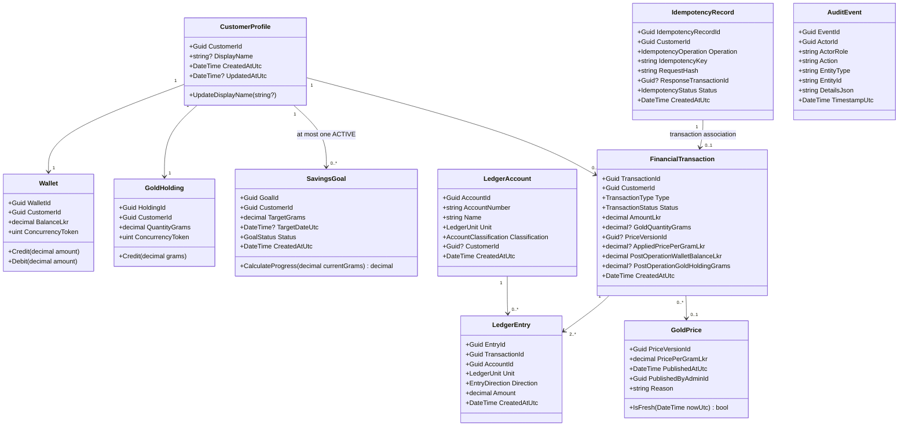

# Nidhi v1 Domain Model

This document defines the core domain concepts, aggregate/consistency boundaries, entities, value objects, and invariants for Nidhi v1. It implements the approved product decisions in [OPEN_DECISIONS.md](../requirements/OPEN_DECISIONS.md) and traces to [FUNCTIONAL_REQUIREMENTS.md](../requirements/FUNCTIONAL_REQUIREMENTS.md).

---

## 1. Domain Design Principles

1. **Pragmatic Clean Domain**: Domain logic lives in `Nidhi.Domain` with zero dependencies on infrastructure, database frameworks, or HTTP primitives.
2. **Separation of Identity and Domain Data**: ASP.NET Core Identity manages credentials, password hashing, security stamps, and token generation (`IdentityUser<Guid>`). Nidhi domain concepts (`CustomerProfile`, `Wallet`, `GoldHolding`) represent business capabilities and are linked to the identity user via `CustomerId` (the Identity user ID).
3. **Financial Precision**: All monetary and commodity calculations use C# `decimal`. Floating-point types (`float`, `double`) are strictly prohibited.
4. **No Speculative Abstractions**: Avoid CQRS, MediatR, generic repositories, or unit of work wrappers. Application services orchestrate domain operations directly within database transactions.

---

Session 4 implements entity storage, restricted setters, and mappings. Methods and lifecycle/orchestration descriptions below express the approved future use cases; they are not implemented financial services. PostgreSQL enforcement limits are detailed in the [ERD](ERD.md#persistence-enforcement-boundaries).

## 2. Core Domain Concepts

---

## 3. Detailed Concept Specifications

### 3.1. Identity User vs Customer Profile

| Attribute | ASP.NET Core Identity (`IdentityUser<Guid>`) | Nidhi Domain: `CustomerProfile` |
|---|---|---|
| **Responsibility** | Authentication, password hash, email confirmation flag, lockout/security stamps. | Business identity, display name, customer-facing profile metadata, ownership root for business aggregates. |
| **Identifier** | `Id` (`Guid`, UUIDv7) | `CustomerId` (`Guid`, matches `IdentityUser.Id` 1:1) |
| **Attributes** | `UserName`, `NormalizedUserName`, `Email`, `NormalizedEmail`, `EmailConfirmed`, `PasswordHash`, `SecurityStamp`, `ConcurrencyStamp` | `CustomerId`, `DisplayName` (optional, max 100 chars), `CreatedAtUtc`, `UpdatedAtUtc` |
| **Invariants** | Handled by ASP.NET Core Identity (unique email, secure password hashing). | Display name cannot exceed 100 characters; email is read from Identity and is not duplicated in the profile. Email and password cannot be mutated via profile updates (OD-009). |
| **Role Assignment** | Role `CUSTOMER` assigned at registration; `ADMIN` provisioned operationally (OD-011). | No role fields stored on domain entity. |

Identity is the source of truth for email and authentication state. Standard Identity persistence also includes `PhoneNumber`, `PhoneNumberConfirmed`, and `TwoFactorEnabled`; their presence does not introduce phone collection or 2FA product workflows in v1.

### 3.2. Wallet

- **Purpose**: Represents a Customer's simulated Sri Lankan Rupee (LKR) cash balance.
- **Identity**: `WalletId` (`Guid`, UUIDv7). Owned 1:1 by `CustomerId`.
- **Attributes**:
  - `WalletId` (`Guid`)
  - `CustomerId` (`Guid`, Unique)
  - `BalanceLkr` (`decimal(18,2)`)
  - `ConcurrencyToken` (`uint`, mapped to PostgreSQL `xmin` system column via EF Core `IsRowVersion()`, ODQ-002)
  - `CreatedAtUtc` (`DateTime`)
  - `UpdatedAtUtc` (`DateTime`)
- **Invariants**:
  - `BalanceLkr >= 0.00m` (nonnegative at all times).
  - `BalanceLkr <= 5,000,000.00m` (maximum balance cap under OD-003).
  - Starts at `0.00m` upon Customer creation.
  - Precision is fixed at 2 decimal places (`decimal(18,2)`).
- **Lifecycle**: Created automatically upon Customer registration. Persists throughout the Customer account lifetime. Balance is modified solely through atomic financial transactions.

### 3.3. Gold Holding

- **Purpose**: Represents a Customer's accumulated simulated gold holdings in grams.
- **Identity**: `HoldingId` (`Guid`, UUIDv7). Owned 1:1 by `CustomerId`.
- **Attributes**:
  - `HoldingId` (`Guid`)
  - `CustomerId` (`Guid`, Unique)
  - `QuantityGrams` (`decimal(20,8)`)
  - `ConcurrencyToken` (`uint`, mapped to PostgreSQL `xmin` system column via EF Core `IsRowVersion()`, ODQ-002)
  - `CreatedAtUtc` (`DateTime`)
  - `UpdatedAtUtc` (`DateTime`)
- **Invariants**:
  - `QuantityGrams >= 0.00000000m` (nonnegative at all times).
  - Starts at `0.00000000m` upon Customer creation.
  - Precision is fixed at 8 decimal places (`decimal(20,8)`).
- **Lifecycle**: Created automatically upon Customer registration. Credited solely through successful gold-saving transactions.

### 3.4. Gold Price

- **Purpose**: Represents an immutable versioned quote of the simulated gold price per gram in LKR.
- **Identity**: `PriceVersionId` (`Guid`, UUIDv7).
- **Attributes**:
  - `PriceVersionId` (`Guid`)
  - `PricePerGramLkr` (`decimal(18,4)`)
  - `PublishedAtUtc` (`DateTime`)
  - `PublishedByAdminId` (`Guid`)
  - `Reason` (`string`, max 500 chars)
  - `AuditLogId` (`Guid`)
- **Invariants**:
  - `PricePerGramLkr > 0.0000m` (strictly positive).
  - Precision is fixed at 4 decimal places (`decimal(18,4)`).
  - Once created, a price version is **completely immutable**. It is never edited or deleted (OD-006).
  - Freshness rule: A price is usable for new purchases if and only if `(NowUtc - PublishedAtUtc) <= 24 hours` (OD-006).
  - Active price determination: The active price is the price version with the latest `PublishedAtUtc` timestamp.

### 3.5. Business Transaction (`FinancialTransaction`)

- **Purpose**: Durable, immutable record and receipt of a committed financial operation. Failed command attempts may be logged or observed separately but never become `FinancialTransaction` history.
- **Identity**: `TransactionId` (`Guid`, UUIDv7).
- **Attributes**:
  - `TransactionId` (`Guid`)
  - `CustomerId` (`Guid`)
  - `Type` (`TransactionType`: `WALLET_FUNDING` | `GOLD_PURCHASE`)
  - `Status` (`TransactionStatus`: `COMPLETED` only)
  - `AmountLkr` (`decimal(18,2)`)
  - `GoldQuantityGrams` (`decimal(20,8)?`, null for funding)
  - `PriceVersionId` (`Guid?`, null for funding)
  - `AppliedPricePerGramLkr` (`decimal(18,4)?`, null for funding)
  - `PostOperationWalletBalanceLkr` (`decimal(18,2)`)
  - `PostOperationGoldHoldingGrams` (`decimal(20,8)?`)
  - `IdempotencyRecordId` (`Guid`, Unique)
  - `CreatedAtUtc` (`DateTime`)
- **Invariants**:
  - Once committed with status `COMPLETED`, the transaction is **completely immutable**.
  - `AmountLkr` is strictly positive (`>= 100.00m` and `<= 1,000,000.00m`).
  - For `GOLD_PURCHASE`, all four gold-specific fields must be non-null, gold quantity and applied price must be positive, and the post-operation holding must be at least the credited quantity. The ERD CHECK uses explicit NULL guards; `PriceVersionId` is a reference, not a positive numeric value.
  - `PostOperationWalletBalanceLkr` retains the exact balance at commit time and never changes upon historical replay.

### 3.6. Ledger Account and Ledger Entry

- **Purpose**: Simplified double-entry bookkeeping establishing strict conservation of funds and gold holdings across isolated unit books (OD-016).
- **Ledger Account Attributes**:
  - `AccountId` (`Guid`, UUIDv7)
  - `AccountNumber` (`string`, e.g., `LKR-CUST-{CustomerId}`, `LKR-SYS-FUNDING`)
  - `Name` (`string`)
  - `Unit` (`LedgerUnit`: `LKR` | `GOLD_GRAMS`)
  - `Classification` (`AccountClassification`: `ASSET`, `LIABILITY`, `EQUITY`, `CLEARING`)
  - `CustomerId` (`Guid?`, null for system counterpart accounts)
- **Ledger Entry Attributes**:
  - `EntryId` (`Guid`, UUIDv7)
  - `TransactionId` (`Guid`, FK to `FinancialTransaction`)
  - `AccountId` (`Guid`, FK to `LedgerAccount`)
  - `Unit` (`LedgerUnit`: `LKR` | `GOLD_GRAMS`)
  - `Direction` (`EntryDirection`: `DEBIT` | `CREDIT`)
  - `Amount` (`decimal`, stored in shared `numeric(20,8)`; LKR cent granularity is an application rule)
  - `CreatedAtUtc` (`DateTime`)
- **Invariants**:
  - Entries within a single transaction must balance strictly per unit:
    - $\sum \text{Debit}_{\text{LKR}} = \sum \text{Credit}_{\text{LKR}}$
    - $\sum \text{Debit}_{\text{GRAMS}} = \sum \text{Credit}_{\text{GRAMS}}$
  - LKR and gold grams are never summed or balanced directly against one another.
  - Each entry's `(AccountId, Unit)` references the ledger account's `(id, unit)` alternate key, enforcing unit equality in PostgreSQL.
  - Entries are immutable by application policy; see the [persistence enforcement boundaries](ERD.md#persistence-enforcement-boundaries).

### 3.7. Savings Goal

- **Purpose**: Customer-defined target to accumulate fractional gold grams (OD-007, OD-008).
- **Identity**: `GoalId` (`Guid`, UUIDv7).
- **Attributes**:
  - `GoalId` (`Guid`)
  - `CustomerId` (`Guid`)
  - `TargetGrams` (`decimal(20,8)`)
  - `TargetDateUtc` (`DateTime?`, optional)
  - `Status` (`GoalStatus`: `ACTIVE` | `COMPLETED` | `REPLACED`)
  - `CreatedAtUtc` (`DateTime`)
  - `UpdatedAtUtc` (`DateTime`)
- **Invariants**:
  - `TargetGrams > 0.00000000m`.
  - At most **one active goal** per Customer at any time (`Status = ACTIVE`). Enforced via database partial unique index.
  - Does not reserve, lock, or allocate wallet cash or gold holdings.
  - Progress is purely derived: $\text{Progress} = \frac{\text{Current Holding Grams}}{\text{TargetGrams}}$.
  - Changes in market price do not alter goal completion.

### 3.8. Idempotency Record

- **Purpose**: Ensures financial command idempotency and safe client retries across network drops or server restarts (OD-012).
- **Identity**: `IdempotencyRecordId` (`Guid`, UUIDv7).
- **Attributes**:
  - `IdempotencyRecordId` (`Guid`)
  - `CustomerId` (`Guid`)
  - `Operation` (`IdempotencyOperation`: `SimulateFunding`, `SaveGold`; stored as a readable string)
  - `IdempotencyKey` (`string`, max 128 chars)
  - `RequestHash` (`string`, SHA-256 hash of canonicalized request payload)
  - `ResponseTransactionId` (`Guid?`, FK to committed `FinancialTransaction`)
  - `Status` (`IdempotencyStatus`: `IN_PROGRESS` | `COMPLETED` | `FAILED`)
  - `CreatedAtUtc` (`DateTime`)
  - `CompletedAtUtc` (`DateTime?`)
- **Invariants**:
  - Scoped uniquely by `(CustomerId, Operation, IdempotencyKey)`.
  - Successful transactions are permanently associated with their idempotency key (OD-012).
  - Equivalent request replay returns the original transaction receipt.
  - Same key with differing request payload produces a conflict (`IDEMPOTENCY_CONFLICT`).

### 3.9. Audit Event

- **Purpose**: Immutable operational audit trail for material administrative actions and security events.
- **Identity**: `EventId` (`Guid`, UUIDv7).
- **Attributes**:
  - `EventId` (`Guid`)
  - `ActorId` (`Guid`, stable Admin or System ID; no mandatory Identity-user FK)
  - `ActorRole` (`string`, `ADMIN` | `SYSTEM`)
  - `Action` (`string`, e.g., `PUBLISH_PRICE`, `BOOTSTRAP_ADMIN`)
  - `EntityType` (`string`, e.g., `GoldPrice`, `User`)
  - `EntityId` (`string`)
  - `DetailsJson` (`string`, structured before/after state and operational reason)
  - `TimestampUtc` (`DateTime`)
- **Invariants**:
  - Strictly append-only. No edits or deletions.
  - Commits atomically with the administrative action (e.g., price publication).
  - Never stores passwords, tokens, or plaintext secrets.
  - System events retain their own actor identity; no human Identity user is fabricated. Actor, subject, and correlation identifiers must remain attributable through the recorded context.

---

## 4. Aggregate & Consistency Boundaries

A consistency boundary defines the scope of data that must be committed atomically within a single database transaction. The planned v1 application services must enforce these boundaries using explicit EF Core database transactions (`using var transaction = await dbContext.Database.BeginTransactionAsync(...)`) and appropriate concurrency controls. Session 4 supplies persistence only; it does not independently guarantee posting-set balance or cross-record financial consistency.

### 4.1. Boundary 1: Customer Simulated Wallet Funding

When a customer deposits simulated LKR, the following elements must commit together or not at all:

1. **Daily Limit Revalidation**: Verify count of successful funding transactions for the customer on the current UTC calendar day is `< 20`.
2. **Wallet Balance Update**: `BalanceLkr = BalanceLkr + AmountLkr` (must be `<= 5,000,000.00m`).
3. **Financial Transaction**: Insert `FinancialTransaction` with `Type = WALLET_FUNDING`, `Status = COMPLETED`.
4. **Ledger Entries**:
   - `DEBIT` System Simulated Funding Source (`LKR-SYS-FUNDING`, `AmountLkr`).
   - `CREDIT` Customer Wallet Account (`LKR-CUST-{CustomerId}`, `AmountLkr`).
5. **Idempotency Record**: Update state to `COMPLETED` and bind `ResponseTransactionId`.

*Failure outcome*: If any step fails (e.g., limit exceeded, database connection failure), the entire transaction rolls back. No partial wallet credit or dangling transaction record exists.

### 4.2. Boundary 2: Customer Gold-Saving Transaction

When a customer converts simulated LKR into simulated gold grams, the following elements must commit together or not at all:

1. **Price Freshness & Identity**: Revalidate that the submitted `PriceVersionId` is the currently active price and `PublishedAtUtc >= NowUtc - 24 hours`.
2. **Wallet Balance Check & Debit**: Verify `Wallet.BalanceLkr >= AmountLkr`. Update `BalanceLkr = BalanceLkr - AmountLkr`.
3. **Gold Holding Credit**: Calculate `CreditedGrams = floor(AmountLkr / PricePerGram, 8)`. Verify `CreditedGrams > 0`. Update `QuantityGrams = QuantityGrams + CreditedGrams`.
4. **Financial Transaction**: Insert `FinancialTransaction` with `Type = GOLD_PURCHASE`, `Status = COMPLETED`, capturing applied price, grams, and post-operation balances.
5. **Ledger Entries**:
   - **LKR Book**:
     - `DEBIT` Customer Wallet Account (`LKR-CUST-{CustomerId}`, `AmountLkr`).
     - `CREDIT` System LKR Conversion Counterpart (`LKR-SYS-CONVERSION`, `AmountLkr`).
   - **Gold Gram Book**:
     - `DEBIT` System Gold Issuance Counterpart (`GOLD-SYS-ISSUANCE`, `CreditedGrams`).
     - `CREDIT` Customer Gold Holding Account (`GOLD-CUST-{CustomerId}`, `CreditedGrams`).
6. **Idempotency Record**: Update state to `COMPLETED` and bind `ResponseTransactionId`.

*Failure outcome*: Atomic rollback on any failure. Customer wallet is never debited without gold holding credit and balanced double-entry ledger records.

### 4.3. Boundary 3: Administrative Gold Price Publication

When an Administrator publishes a new simulated gold price:

1. **Insert Gold Price**: Insert new immutable `GoldPrice` row with new `PriceVersionId`, `PublishedAtUtc = NowUtc`, and positive price.
2. **Insert Audit Event**: Insert `AuditEvent` row recording `Action = PUBLISH_PRICE`, `PriceVersionId`, `PricePerGramLkr`, `Reason`, and `PublishedByAdminId`.

*Failure outcome*: If audit logging fails, price publication rolls back. An un-audited price version is never committed (OD-006, NFR-AUDIT-001).

---

## 5. Traceability Matrix

| Functional Requirement | Domain Concept(s) | Aggregate / Consistency Boundary |
|---|---|---|
| **FR-AUTH-001** (Register) | `IdentityUser`, `CustomerProfile`, `Wallet`, `GoldHolding` | User registration transaction (creates user, profile, zero wallet, zero holding) |
| **FR-PROFILE-001** (Profile) | `CustomerProfile` | Profile update boundary (display name only) |
| **FR-WALLET-002** (Funding) | `Wallet`, `FinancialTransaction`, `LedgerAccount`, `LedgerEntry`, `IdempotencyRecord` | Boundary 1: Simulated Wallet Funding |
| **FR-WALLET-003** (Retry Funding) | `IdempotencyRecord`, `FinancialTransaction` | Idempotency lookup / replay |
| **FR-GOLD-001** (View Price) | `GoldPrice` | Read-only query (latest `PublishedAtUtc`) |
| **FR-GOLD-002** (Save Gold) | `Wallet`, `GoldHolding`, `GoldPrice`, `FinancialTransaction`, `LedgerEntry`, `IdempotencyRecord` | Boundary 2: Gold-Saving Transaction |
| **FR-GOLD-003** (Receipt) | `FinancialTransaction` | Read-only immutable transaction query |
| **FR-GOAL-001** / **002** (Goal) | `SavingsGoal`, `GoldHolding` | Savings goal creation / progress calculation |
| **FR-ADMIN-004** (Ledger) | `LedgerAccount`, `LedgerEntry`, `FinancialTransaction` | Read-only ledger inspection query |
| **FR-ADMIN-006** (Publish Price)| `GoldPrice`, `AuditEvent` | Boundary 3: Price Publication & Audit |
| **FR-AUDIT-001** (Audit Trail) | `AuditEvent` | Audit review query / event recording |
