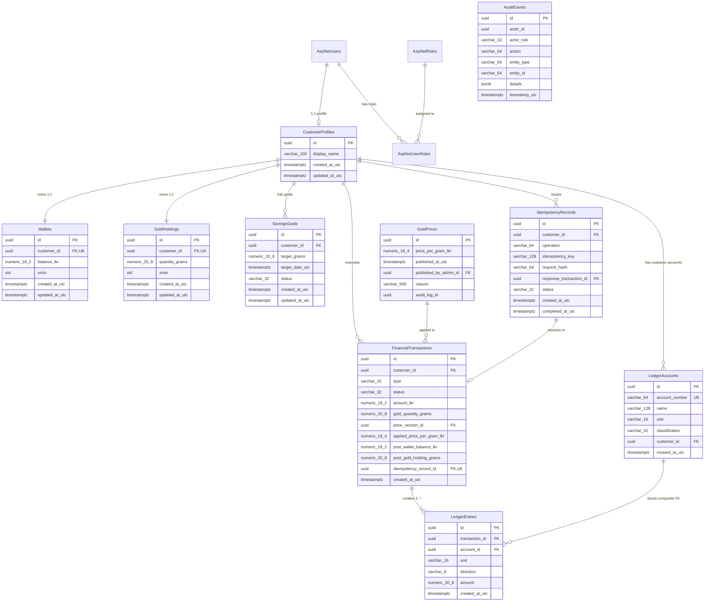

# Nidhi v1 Relational Data Model & ERD

This document specifies the conceptual relational database schema, tables, column definitions, constraints, and indexes for Nidhi v1 on PostgreSQL using Entity Framework Core. It satisfies [OPEN_DECISIONS.md](../requirements/OPEN_DECISIONS.md) (OD-003, OD-004, OD-005, OD-008, OD-011, OD-016), [FUNCTIONAL_REQUIREMENTS.md](../requirements/FUNCTIONAL_REQUIREMENTS.md), and [NON_FUNCTIONAL_REQUIREMENTS.md](../requirements/NON_FUNCTIONAL_REQUIREMENTS.md).

---

## 1. Entity Relationship Diagram (ERD)



---

## 2. Table Specifications

### 2.1. ASP.NET Core Identity Tables
Standard ASP.NET Core Identity schema mapped to PostgreSQL with `Guid` user/role keys (standard claim-row IDs remain integer identity columns):
- `asp_net_users`: Holds core authentication credentials (`id`, `user_name`, `normalized_user_name`, `email`, `normalized_email`, `email_confirmed`, `password_hash`, `security_stamp`, `concurrency_stamp`, `phone_number`, `phone_number_confirmed`, `two_factor_enabled`, `lockout_end`, `lockout_enabled`, `access_failed_count`).
- `asp_net_roles`: System roles (`id`, `name`, `normalized_name`, `concurrency_stamp`). The approved roles are `CUSTOMER` and `ADMIN`; provisioning is deferred and the initial migration seeds neither role.
- `asp_net_user_roles`: Role assignments (`user_id`, `role_id`).
- `asp_net_user_tokens`: Standard Identity token persistence; token workflows are deferred.
- `asp_net_user_claims`, `asp_net_role_claims`, `asp_net_user_logins`: Standard Identity claim and external-login storage. Their presence does not enable product workflows.

Identity is the sole source of truth for email. `EmailIndex` uniquely indexes `normalized_email`; no email column or email index exists on `customer_profiles`. Built-in phone-number and two-factor columns remain part of standard Identity persistence, but Nidhi v1 exposes no phone collection or 2FA workflow.

---

### 2.2. `customer_profiles`
Stores display-name and timestamp metadata linked 1:1 to `asp_net_users`. Email and authentication state belong only to Identity; profile reads obtain email from Identity when required.

| Column | Type | Nullable | Description & Constraints |
|---|---|---|---|
| `id` | `uuid` | NO | Primary Key. Matches `asp_net_users.id` 1:1. |
| `display_name` | `varchar(100)` | YES | Optional display name (OD-001, OD-009). |
| `created_at_utc` | `timestamptz` | NO | Account registration timestamp. |
| `updated_at_utc` | `timestamptz` | YES | Last profile edit timestamp. |

**Indexes**:
- `PK_customer_profiles`: Primary key on `id`.

---

### 2.3. `wallets`
Customer simulated LKR cash balance.

| Column | Type | Nullable | Description & Constraints |
|---|---|---|---|
| `id` | `uuid` | NO | Primary Key (UUIDv7). |
| `customer_id` | `uuid` | NO | Foreign Key to `customer_profiles.id`. Unique (1:1). |
| `balance_lkr` | `numeric(18,2)` | NO | Current simulated LKR balance. Default `0.00`. |
| `xmin` | `xid` | NO | PostgreSQL system column for optimistic concurrency (mapped via EF Core IsRowVersion(), ODQ-002). |
| `created_at_utc` | `timestamptz` | NO | Creation timestamp. |
| `updated_at_utc` | `timestamptz` | YES | Last mutation timestamp. |

**Check Constraints**:
- `chk_wallets_balance_non_negative`: `balance_lkr >= 0.00`.
- `chk_wallets_balance_max_cap`: `balance_lkr <= 5000000.00` (OD-003).

**Indexes**:
- `PK_wallets`: Primary key on `id`.
- `UK_wallets_customer_id`: Unique index on `customer_id`.

---

### 2.4. `gold_holdings`
Customer accumulated simulated gold grams.

| Column | Type | Nullable | Description & Constraints |
|---|---|---|---|
| `id` | `uuid` | NO | Primary Key (UUIDv7). |
| `customer_id` | `uuid` | NO | Foreign Key to `customer_profiles.id`. Unique (1:1). |
| `quantity_grams` | `numeric(20,8)` | NO | Current simulated gold holding in grams. Default `0.00000000`. |
| `xmin` | `xid` | NO | PostgreSQL system column for optimistic concurrency (mapped via EF Core IsRowVersion(), ODQ-002). |
| `created_at_utc` | `timestamptz` | NO | Creation timestamp. |
| `updated_at_utc` | `timestamptz` | YES | Last mutation timestamp. |

**Check Constraints**:
- `chk_gold_holdings_quantity_non_negative`: `quantity_grams >= 0.00000000`.

**Indexes**:
- `PK_gold_holdings`: Primary key on `id`.
- `UK_gold_holdings_customer_id`: Unique index on `customer_id`.

---

### 2.5. `gold_prices`
Immutable simulated gold price versions published by administrators.

| Column | Type | Nullable | Description & Constraints |
|---|---|---|---|
| `id` | `uuid` | NO | Primary Key (UUIDv7), `PriceVersionId`. |
| `price_per_gram_lkr`| `numeric(18,4)` | NO | Simulated price per gram in LKR (OD-005). |
| `published_at_utc` | `timestamptz` | NO | Timestamp of publication. |
| `published_by_admin_id`| `uuid` | NO | Foreign Key to `asp_net_users.id`. |
| `reason` | `varchar(500)` | NO | Justification/note for price publication. |
| `audit_log_id` | `uuid` | NO | Correlation ID linking the audit record. |

**Check Constraints**:
- `chk_gold_prices_price_positive`: `price_per_gram_lkr > 0.0000`.

**Indexes**:
- `PK_gold_prices`: Primary key on `id`.
- `IX_gold_prices_published_at_utc`: B-tree index on `published_at_utc DESC` (for fast active price lookup).

---

### 2.6. `financial_transactions`
Immutable records of committed wallet funding and gold-saving operations only. Failed commands may be logged or observed separately; they do not create financial transaction rows.

| Column | Type | Nullable | Description & Constraints |
|---|---|---|---|
| `id` | `uuid` | NO | Primary Key (UUIDv7). |
| `customer_id` | `uuid` | NO | Foreign Key to `customer_profiles.id`. |
| `type` | `varchar(32)` | NO | `'WALLET_FUNDING'` or `'GOLD_PURCHASE'`. |
| `status` | `varchar(32)` | NO | Always `'COMPLETED'`. |
| `amount_lkr` | `numeric(18,2)` | NO | Requested LKR amount (100.00 to 1,000,000.00). |
| `gold_quantity_grams` | `numeric(20,8)` | YES | Credited gold grams. Required if `type = 'GOLD_PURCHASE'`. |
| `price_version_id` | `uuid` | YES | FK to `gold_prices.id`. Required if `type = 'GOLD_PURCHASE'`. |
| `applied_price_per_gram_lkr` | `numeric(18,4)` | YES | Applied price. Required if `type = 'GOLD_PURCHASE'`. |
| `post_wallet_balance_lkr` | `numeric(18,2)` | NO | Snapshot of wallet balance immediately post-commit. |
| `post_gold_holding_grams` | `numeric(20,8)` | YES | Snapshot of holding post-commit. Required if `GOLD_PURCHASE`. |
| `idempotency_record_id` | `uuid` | NO | FK to `idempotency_records.id`. Unique (1:1). |
| `created_at_utc` | `timestamptz` | NO | Commit timestamp. |

**Check Constraints**:
- `chk_transactions_type_valid`: `type IN ('WALLET_FUNDING', 'GOLD_PURCHASE')`.
- `chk_transactions_status_valid`: `status = 'COMPLETED'`.
- `chk_transactions_amount_range`: `amount_lkr >= 100.00 AND amount_lkr <= 1000000.00`.
- `chk_transactions_gold_purchase_fields`:
  ```sql
  (type = 'WALLET_FUNDING' AND gold_quantity_grams IS NULL AND price_version_id IS NULL AND applied_price_per_gram_lkr IS NULL AND post_gold_holding_grams IS NULL)
  OR
  (type = 'GOLD_PURCHASE' AND gold_quantity_grams IS NOT NULL AND gold_quantity_grams > 0.00000000 AND price_version_id IS NOT NULL AND applied_price_per_gram_lkr IS NOT NULL AND applied_price_per_gram_lkr > 0.0000 AND post_gold_holding_grams IS NOT NULL AND post_gold_holding_grams >= gold_quantity_grams)
  ```

PostgreSQL rejects a CHECK only when its expression is `FALSE`; `TRUE` and `UNKNOWN` (NULL) pass. Explicit `IS NOT NULL` guards in the purchase branch therefore enforce the already-approved required-field rule. This is a persistence clarification, not a product-rule change.

**Indexes**:
- `PK_financial_transactions`: Primary key on `id`.
- `IX_financial_transactions_customer_created`: Index on `(customer_id, created_at_utc DESC)` for customer history.
- `IX_financial_transactions_created_at`: Index on `created_at_utc DESC` for admin list.
- `UK_financial_transactions_idempotency`: Unique index on `idempotency_record_id`.

---

### 2.7. `ledger_accounts`
Chart of accounts for double-entry bookkeeping.

| Column | Type | Nullable | Description & Constraints |
|---|---|---|---|
| `id` | `uuid` | NO | Primary Key (UUIDv7). |
| `account_number` | `varchar(64)` | NO | Unique account code (e.g. `1001-LKR-SYS-FUNDING`). |
| `name` | `varchar(128)` | NO | Human-readable account title. |
| `unit` | `varchar(16)` | NO | `'LKR'` or `'GOLD_GRAMS'`. |
| `classification` | `varchar(32)` | NO | `'ASSET'`, `'LIABILITY'`, `'EQUITY'`, or `'CLEARING'`. |
| `customer_id` | `uuid` | YES | FK to `customer_profiles.id`. NULL for system accounts. |
| `created_at_utc` | `timestamptz` | NO | Creation timestamp. |

**Check Constraints**:
- `chk_ledger_accounts_unit_valid`: `unit IN ('LKR', 'GOLD_GRAMS')`.
- `chk_ledger_accounts_class_valid`: `classification IN ('ASSET', 'LIABILITY', 'EQUITY', 'CLEARING')`.

**Indexes**:
- `PK_ledger_accounts`: Primary key on `id`.
- `UK_ledger_accounts_account_number`: Unique index on `account_number`.
- `AK_ledger_accounts_id_unit`: Supporting alternate key / unique constraint on `(id, unit)` for the ledger-entry composite foreign key.
- `IX_ledger_accounts_customer_id`: Index on `customer_id`.

---

### 2.8. `ledger_entries`
Immutable double-entry debits and credits.

| Column | Type | Nullable | Description & Constraints |
|---|---|---|---|
| `id` | `uuid` | NO | Primary Key (UUIDv7). |
| `transaction_id` | `uuid` | NO | Foreign Key to `financial_transactions.id`. |
| `account_id` | `uuid` | NO | Part of composite FK `(account_id, unit)` to `ledger_accounts(id, unit)`. |
| `unit` | `varchar(16)` | NO | `'LKR'` or `'GOLD_GRAMS'`. |
| `direction` | `varchar(8)` | NO | `'DEBIT'` or `'CREDIT'`. |
| `amount` | `numeric(20,8)` | NO | Strictly positive decimal amount. |
| `created_at_utc` | `timestamptz` | NO | Timestamp matching parent transaction. |

**Relationship constraint**: `FK_ledger_entries_ledger_accounts_account_id_unit` references `AK_ledger_accounts_id_unit` through `(account_id, unit)`. This guarantees that an entry exists only with the same unit as its ledger account. The supporting index is `IX_ledger_entries_account_id_unit`.

**Check Constraints**:
- `chk_ledger_entries_amount_positive`: `amount > 0`.
- `chk_ledger_entries_unit_valid`: `unit IN ('LKR', 'GOLD_GRAMS')`.
- `chk_ledger_entries_direction_valid`: `direction IN ('DEBIT', 'CREDIT')`.

**Indexes**:
- `PK_ledger_entries`: Primary key on `id`.
- `IX_ledger_entries_tx_unit`: Index on `(transaction_id, unit)` for transaction balancing inspection.
- `IX_ledger_entries_account_created`: Index on `(account_id, created_at_utc DESC)` for account reconciliation.

---

### 2.9. `savings_goals`
Customer savings goals targeting fractional gold grams.

| Column | Type | Nullable | Description & Constraints |
|---|---|---|---|
| `id` | `uuid` | NO | Primary Key (UUIDv7). |
| `customer_id` | `uuid` | NO | Foreign Key to `customer_profiles.id`. |
| `target_grams` | `numeric(20,8)` | NO | Goal target in gold grams. Strictly positive. |
| `target_date_utc` | `timestamptz` | YES | Optional target completion date. |
| `status` | `varchar(32)` | NO | `'ACTIVE'`, `'COMPLETED'`, or `'REPLACED'`. |
| `created_at_utc` | `timestamptz` | NO | Creation timestamp. |
| `updated_at_utc` | `timestamptz` | YES | Status update timestamp. |

**Check Constraints**:
- `chk_savings_goals_target_positive`: `target_grams > 0.00000000`.
- `chk_savings_goals_status_valid`: `status IN ('ACTIVE', 'COMPLETED', 'REPLACED')`.

**Indexes**:
- `PK_savings_goals`: Primary key on `id`.
- `IX_savings_goals_customer_id`: Index on `customer_id`.
- **Partial Unique Index (One Active Goal per Customer, OD-008)**:
  ```sql
  CREATE UNIQUE INDEX uq_savings_goals_one_active_per_customer
  ON savings_goals (customer_id)
  WHERE (status = 'ACTIVE');
  ```

---

### 2.10. `idempotency_records`
Permanent idempotency storage for financial commands.

| Column | Type | Nullable | Description & Constraints |
|---|---|---|---|
| `id` | `uuid` | NO | Primary Key (UUIDv7). |
| `customer_id` | `uuid` | NO | Foreign Key to `customer_profiles.id`. |
| `operation` | `varchar(64)` | NO | `'SimulateFunding'` or `'SaveGold'`. |
| `idempotency_key` | `varchar(128)` | NO | Client-supplied key. |
| `request_hash` | `varchar(64)` | NO | SHA-256 hash of canonicalized request payload. |
| `response_transaction_id`| `uuid` | YES | FK to `financial_transactions.id`. Populated on completion. |
| `status` | `varchar(32)` | NO | `'IN_PROGRESS'`, `'COMPLETED'`, or `'FAILED'`. |
| `created_at_utc` | `timestamptz` | NO | First receipt timestamp. |
| `completed_at_utc` | `timestamptz` | YES | Completion timestamp. |

**Check Constraints**:
- `chk_idempotency_status_valid`: `status IN ('IN_PROGRESS', 'COMPLETED', 'FAILED')`.

**Indexes**:
- `PK_idempotency_records`: Primary key on `id`.
- `UK_idempotency_scoped_key`: Unique index on `(customer_id, operation, idempotency_key)` (OD-012).
- `IX_idempotency_response_tx`: Index on `response_transaction_id`.

---

### 2.11. `audit_events`
Audit trail for material administrative or system-generated operational events. System actors need not be Identity users. Required actor IDs, actor roles, action/subject identifiers, timestamps, and details preserve attribution without inventing a human actor. `gold_prices.audit_log_id` is an auditable correlation identifier, not a database-enforced FK; application orchestration must preserve its association with the audit event.

| Column | Type | Nullable | Description & Constraints |
|---|---|---|---|
| `id` | `uuid` | NO | Primary Key (UUIDv7). |
| `actor_id` | `uuid` | NO | Stable admin or system actor identifier; no mandatory Identity-user FK. |
| `actor_role` | `varchar(32)` | NO | Role of actor (`'ADMIN'`, `'SYSTEM'`). |
| `action` | `varchar(64)` | NO | Operational action (e.g. `'PUBLISH_PRICE'`). |
| `entity_type` | `varchar(64)` | NO | Target entity class (`'GoldPrice'`). |
| `entity_id` | `varchar(64)` | NO | Stringified ID of target entity. |
| `details` | `jsonb` | NO | Structured JSON payload of change context. |
| `timestamp_utc` | `timestamptz` | NO | Audit event occurrence timestamp. |

**Indexes**:
- `PK_audit_events`: Primary key on `id`.
- `IX_audit_events_timestamp`: Index on `timestamp_utc DESC` for chronological admin review.
- `IX_audit_events_actor`: Index on `(actor_id, timestamp_utc DESC)`.
- `IX_audit_events_action`: Index on `(action, timestamp_utc DESC)`.

---

## 3. Database Constraints Summary

The PostgreSQL database enforces the following structural, business, and financial invariants:

1. **Balance Non-Negativity**: `wallets.balance_lkr >= 0.00` and `gold_holdings.quantity_grams >= 0.00000000`.
2. **Wallet Maximum Cap**: `wallets.balance_lkr <= 5000000.00` (OD-003).
3. **Gold Price Positivity**: `gold_prices.price_per_gram_lkr > 0.0000`.
4. **Transaction Amount Ranges**: `financial_transactions.amount_lkr BETWEEN 100.00 AND 1000000.00`.
5. **Gold Purchase Invariants**: If `type = 'GOLD_PURCHASE'`, `gold_quantity_grams > 0`, `applied_price_per_gram_lkr > 0`, and `price_version_id IS NOT NULL`.
6. **One Active Goal per Customer**: Enforced by partial unique index `uq_savings_goals_one_active_per_customer WHERE status = 'ACTIVE'` (OD-008).
7. **Unique Idempotency Scoping**: `(customer_id, operation, idempotency_key)` is globally unique (OD-012).
8. **Positive Ledger Entries**: `ledger_entries.amount > 0` for all entries.
9. **Ledger Account/Entry Unit Equality**: `(account_id, unit)` must reference the account alternate key `(id, unit)`.

## Persistence enforcement boundaries

Session 4 validates row checks, foreign keys, unique/partial indexes, numeric mappings, and system `xmin` concurrency. PostgreSQL does not independently enforce all business invariants:

| Invariant | Enforcement responsibility |
|---|---|
| Append-only financial, price, ledger, and audit history | Restricted domain setters and controlled application writes; privileged/manual SQL can still update or delete records. No append-only triggers are installed. |
| Whole-posting-set ledger balance | Application transaction orchestration must create and validate the complete posting set per unit; reconciliation and use-case tests verify conservation. Row checks alone cannot prove balance. |
| LKR cent granularity in ledger entries | Application validation must enforce cents for LKR in the shared `numeric(20,8)` amount column, which also stores gold grams. |
| Cross-record financial consistency | Application transactions and concurrency controls must coordinate wallet/holding changes, receipts, ledger entries, price validation, and idempotency associations. Foreign keys establish references, not these financial relationships. |

These are approved application responsibilities, not guarantees already delivered by Session 4. Financial use-case orchestration and its tests remain future implementation work. The existing persistence tests prove structural constraints and concurrency behavior, not complete financial operations.
