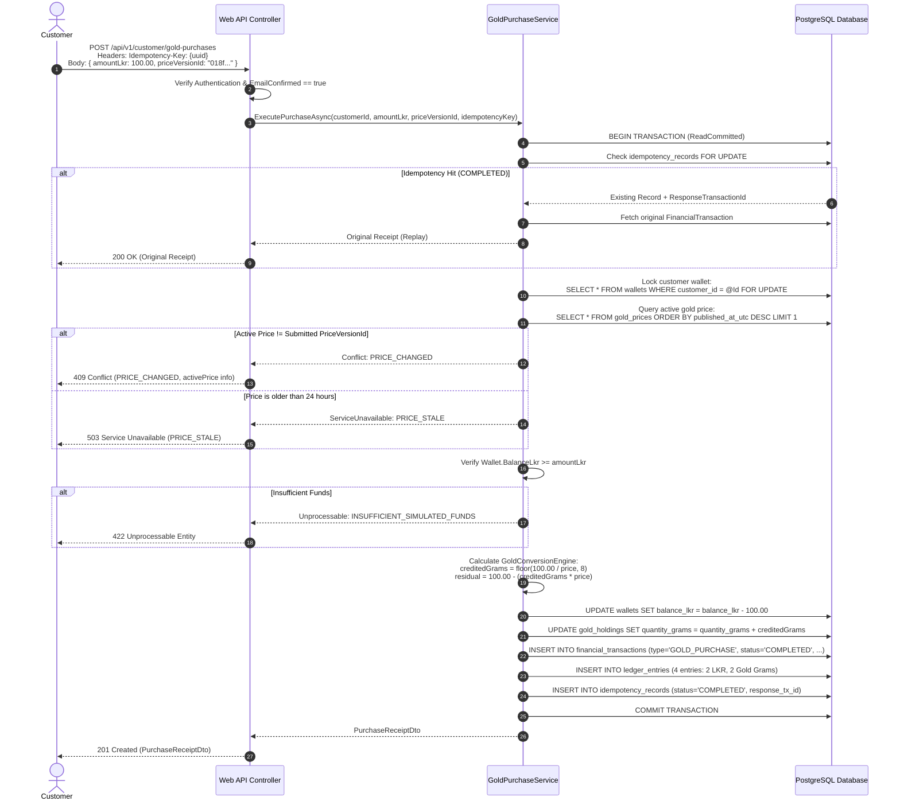
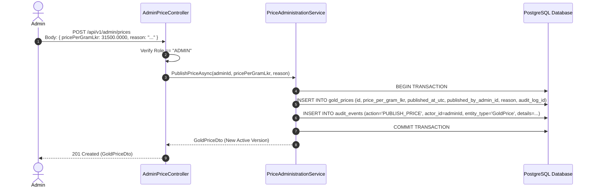

# Nidhi v1 Architecture Traceability & Overengineering Review

This document maps all v1 requirements to their domain concepts, API endpoints, and database structures. It also includes core sequence diagrams and an explicit evaluation against unnecessary engineering complexity.

---

## 1. End-to-End Requirement Traceability Matrix

| Functional Requirement | Core Domain Concept | API Resource Endpoint | Database Tables Involved |
|---|---|---|---|
| **FR-PUB-001** (Understand Nidhi) | Marketing Content | Static / Landing Pages | None (Static) |
| **FR-PUB-002** (Disclosures) | Simulation Disclosures | Public landing / footer | None (Static) |
| **FR-AUTH-001** (Register Customer) | `IdentityUser`, `CustomerProfile`, `Wallet`, `GoldHolding` | `POST /api/v1/auth/register` | `asp_net_users`, `customer_profiles`, `wallets`, `gold_holdings` |
| **FR-AUTH-002** (Login) | `IdentityUser`, HttpOnly Cookie | `POST /api/v1/auth/login` | `asp_net_users`, `asp_net_user_roles` |
| **FR-AUTH-003** (Logout) | Session Invalidation | `POST /api/v1/auth/logout` | None (Cookie invalidated) |
| **FR-AUTH-004** (Account Protection)| Role Authorization, CSRF Defense | ASP.NET Core Authorize, `GET /api/v1/auth/antiforgery` | `asp_net_user_roles`, `asp_net_roles` |
| **FR-AUTH-005** (Email Verification)| `IdentityUser.EmailConfirmed` | `POST /api/v1/auth/verify-email` | `asp_net_users`, `asp_net_user_tokens` |
| **FR-AUTH-006** (Password Recovery) | `IdentityUser.PasswordHash` | `POST /api/v1/auth/forgot-password`, `reset-password` | `asp_net_users`, `asp_net_user_tokens` |
| **FR-AUTH-007** (Admin Provisioning)| Operational Bootstrapper | CLI / Seeder Command | `asp_net_users`, `asp_net_user_roles`, `audit_events` |
| **FR-PROFILE-001** (Customer Profile)| `CustomerProfile` | `GET/PATCH /api/v1/customer/profile` | `customer_profiles` |
| **FR-WALLET-001** (View Wallet) | `Wallet` | `GET /api/v1/customer/wallet` | `wallets` |
| **FR-WALLET-002** (Add Funds) | `Wallet`, `FinancialTransaction`, `LedgerAccount`, `LedgerEntry` | `POST /api/v1/customer/wallet/fundings` | `wallets`, `financial_transactions`, `ledger_entries`, `idempotency_records` |
| **FR-WALLET-003** (Retry Funding) | `IdempotencyRecord`, `FinancialTransaction` | `POST /api/v1/customer/wallet/fundings` (Header) | `idempotency_records`, `financial_transactions` |
| **FR-GOLD-001** (View Price) | `GoldPrice` | `GET /api/v1/customer/gold-price`, `GET /api/v1/public/gold-price` | `gold_prices` |
| **FR-GOLD-002** (Save Gold) | `Wallet`, `GoldHolding`, `GoldPrice`, `FinancialTransaction`, `LedgerEntry` | `POST /api/v1/customer/gold-purchases` | `wallets`, `gold_holdings`, `gold_prices`, `financial_transactions`, `ledger_entries`, `idempotency_records` |
| **FR-GOLD-003** (Saving Receipt) | `FinancialTransaction` | `GET /api/v1/customer/transactions/{id}` | `financial_transactions` |
| **FR-GOLD-004** (Retry Gold Save) | `IdempotencyRecord`, `FinancialTransaction` | `POST /api/v1/customer/gold-purchases` (Header) | `idempotency_records`, `financial_transactions` |
| **FR-HOLDING-001** (View Holdings) | `GoldHolding`, `GoldPrice` | `GET /api/v1/customer/holdings` | `gold_holdings`, `gold_prices` |
| **FR-HOLDING-002** (Dashboard) | Aggregate View | `GET /api/v1/customer/dashboard` | `wallets`, `gold_holdings`, `gold_prices`, `financial_transactions`, `savings_goals` |
| **FR-TRANSACTION-001** (History) | `FinancialTransaction` | `GET /api/v1/customer/transactions` | `financial_transactions` |
| **FR-TRANSACTION-002** (Details) | `FinancialTransaction` | `GET /api/v1/customer/transactions/{id}` | `financial_transactions` |
| **FR-GOAL-001** (Create Goal) | `SavingsGoal` | `POST /api/v1/customer/savings-goal` | `savings_goals` |
| **FR-GOAL-002** (Goal Progress) | `SavingsGoal`, `GoldHolding` | `GET /api/v1/customer/savings-goal` | `savings_goals`, `gold_holdings` |
| **FR-ADMIN-001** (Admin Dashboard) | Operational Metrics | `GET /api/v1/admin/dashboard` | `customer_profiles`, `financial_transactions`, `gold_prices` |
| **FR-ADMIN-002** (Find Customers) | `CustomerProfile` | `GET /api/v1/admin/customers` | `customer_profiles` |
| **FR-ADMIN-003** (Customer Details)| Customer Aggregate | `GET /api/v1/admin/customers/{id}` | `customer_profiles`, `wallets`, `gold_holdings` |
| **FR-ADMIN-004** (Inspect Ledger) | `FinancialTransaction`, `LedgerEntry`, `LedgerAccount` | `GET /api/v1/admin/transactions/{id}/ledger` | `financial_transactions`, `ledger_entries`, `ledger_accounts` |
| **FR-ADMIN-005** (Price History) | `GoldPrice` | `GET /api/v1/admin/prices` | `gold_prices` |
| **FR-ADMIN-006** (Publish Price) | `GoldPrice`, `AuditEvent` | `POST /api/v1/admin/prices` | `gold_prices`, `audit_events` |
| **FR-AUDIT-001** / **002** (Audit) | `AuditEvent` | `GET /api/v1/admin/audit-events` | `audit_events` |

---

## 2. Core Execution Sequences

### 2.1. Gold Purchase Execution Sequence (FR-GOLD-002)

---

### 2.2. Administrative Price Publication Sequence (FR-ADMIN-006)

---

## 3. Deliberate Avoidance of Overengineering

In compliance with `AGENTS.md` and the pair programming development discipline, this design was rigorously audited to eliminate unnecessary enterprise patterns:

1. **No Microservices**: The entire system is designed as a single modular monolith (`Nidhi.Api`, `Nidhi.Application`, `Nidhi.Domain`, `Nidhi.Infrastructure`). All operations occur within a single database and transaction space.
2. **No CQRS / MediatR / AutoMapper**: Application services invoke domain operations directly and map to API DTOs using straightforward C# methods or constructors. This eliminates cognitive overhead, layer indirection, and runtime reflection debugging.
3. **No Generic Repositories or Custom Unit of Work**: EF Core's `DbContext` already implements the Unit of Work and Repository patterns. Creating an extra abstraction over EF Core (`IRepository<T>`, `IUnitOfWork`) adds code bloat without testability benefits.
4. **No Message Queues / Event Buses (Kafka, RabbitMQ, Redis)**: All financial mutations (wallet credit/debit, ledger posting, transaction receipting) are synchronous and atomic within PostgreSQL database transactions. Introducing distributed messaging would introduce eventual consistency anomalies, dual-write failures, and infrastructure maintenance costs.
5. **No Event Sourcing**: Account balances are represented as durable projections in `wallets` and `gold_holdings`, backed by double-entry ledger entries in `ledger_entries`. This delivers full historical auditability without the operational complexity of an event store.
6. **No Speculative Extensibility**: We deliberately rejected unused transaction types (e.g., `WITHDRAWAL`, `TRANSFER`, `INTEREST`), generic account suspension state machines, multi-currency models, or document KYC scaffolding. Every design element directly serves an approved v1 product requirement.
